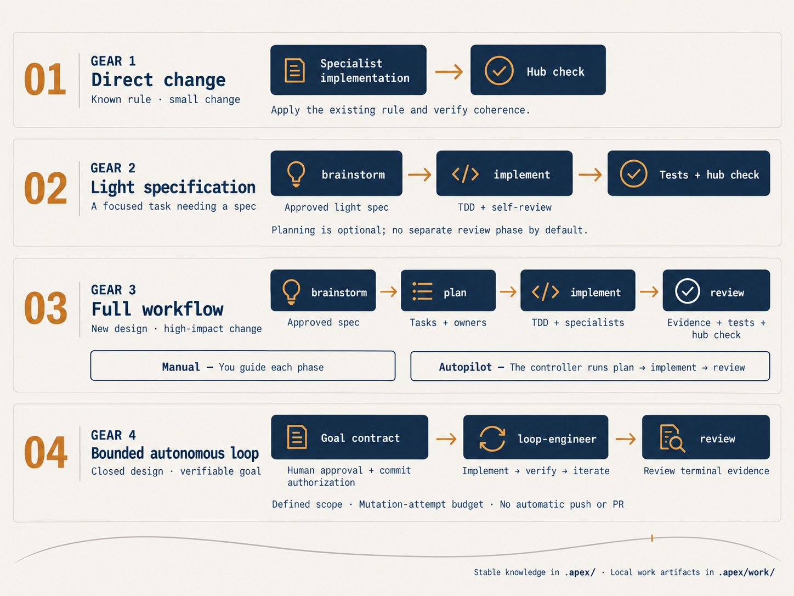

# The ceremony model

How steepy-apex decides how much process a task deserves — and what each gear runs. This is the workflow reference linked from the [README](../README.md).

## Every task gets classified

You have a task. The gear-aware workflow entry checks whether the hub already decides it:

- **COVERED** — a rule decides it → apply it and cite the rule.
- **CONFLICT** — a rule contradicts the change → stop and surface it; the doc wins unless you explicitly override, and the override updates the doc, so code and docs never diverge silently.
- **GAP** — nothing decides it → explore the code first.

Every verdict carries `file:line` evidence. Cross that verdict with how consequential or irreversible the change is, and you get a ceremony **gear**:

| Gear | When | Ceremony |
|---|---|---|
| **1** | COVERED + low value | Straight to the specialist agent; coherence linter at the end. |
| **2** | COVERED + high value, or GAP + low value | Light spec → direct implementation → surface test + linter; no plan/review phase or subagent reviewer by default. |
| **3** | GAP + high value, or irreversible | Full chain: brainstorm → plan → implement → review. |
| **4** | Closed design + machine-verifiable goal + human confirmation | Autonomous bounded loop: author the goal contract, the loop iterates without per-turn gates, review morning-after. |

  

[View the workflow overview at full resolution](../assets/workflow-gears.png).

In gear 3, subagent reviewers are spent only on the **code diff** (per-task and whole-branch); prose artifacts (spec, plan) get a self-review plus a human approval gate — blocking in manual drive, and in autopilot the plan gate collapses to a non-blocking checkpoint (the contract carries the pre-authorization). The entry records the ratified gear once; downstream phases honor their accepted artifact metadata or manifest contract scalars without reopening undeclared upstream work.

Gear 2 takes the lean short circuit: `brainstorm` produces a READY light spec whose default next
phase is `implement`. Implementation derives one self-contained task, runs it under TDD, self-verifies
the criteria, then runs the surface test and `validate-hub` before terminating. A light plan remains
available only as an explicit opt-in when the spec cannot be executed as one independently testable
task; invoking it does not add Gear-3 human or subagent review gates.

## Model selection

Steepy Apex matches model capability to each task’s complexity and risk to avoid spending
high-capability model effort on routine work. The goal is to balance cost, quality, and
completion effort: a cheaper model that needs more attempts can cost more overall.
Actual savings depend on the task, provider pricing, and harness support.

The gear determines the workflow. The model tier determines which level of capability
handles a particular task within that workflow; there is no fixed Gear 1 → cheap,
Gear 2 → standard, Gear 3 → most-capable mapping.

| Task characteristics | Model tier | Typical use |
|---|---|---|
| Mechanical work with the exact implementation already specified | `cheap` | Transcription or a tightly specified edit in one or two files. |
| Integration, multiple files, or implementation judgment | `standard` | Connecting components and implementing requirements from prose. |
| Design, architecture, high risk, or subtle behavior | `most-capable` | Resolving design decisions or handling consequential changes. |

Plans label each task `mechanical`, `integration`, or `design`; implementation uses that
label to select the tier. Direct Gear 2 implementation uses the light spec’s feature
complexity. Reviewers use at least `standard`, rising to `most-capable` for high-risk or
subtle work. The top tier is the top of the configured three-tier ladder, not an unrestricted
request for the most expensive model available. Overrides and their reasons are recorded.

### Providers and harnesses

A **provider** supplies the model; a **harness** is the coding-agent host that runs it.
The shared policy uses the same three tiers across providers. The configured
[model mappings](../adapters/model-mappings.mjs) translate those tiers to concrete models
for OpenAI, Anthropic, ZAI Coding Plan, and DeepSeek. A provider with fewer models may
map two tiers to the same model. These mappings describe the shipped configuration,
not a guarantee that every model is available to every account or host.

| Harness | How Steepy applies model selection |
|---|---|
| Claude Code and Codex | The deterministic runners pass the tier’s configured model explicitly. In interactive workflows, skills request explicit subagent model selection where the host supports it. |
| OpenCode | Interactive tier agents require a configured model pinned to a mapped provider. Headless selection requires an injected verified mapping; without one, selection falls back to the session model and reports that limitation. |
| Pi and DeepSeek Harness | The current Steepy adapters use the session model and record that limitation; they do not provide per-task model switching or deterministic Gear-3/4 runners. |

Selection stays within the configured provider; Steepy does not automatically shop across
providers or switch accounts to find a lower price. When the host cannot apply a tier,
the workflow records the session-model fallback instead of claiming a model switch.
In OpenCode, a task whose tier differs from its registered specialist’s fixed tier uses
the matching tier agent with the specialist instructions carried into its prompt.

Autopilot also distinguishes orchestration from task execution: implement and review
controllers normally use `standard`, with `cheap` eligible for implementation of an
all-mechanical plan; the planning controller follows the spec’s complexity. Individual
tasks inside the implementation phase retain their own tier choices. The workflow ledger
records the model used, review iterations, overrides, and capability limitations.

### Keeping pace with models and harnesses

Model selection depends on the installed harness version, its model-selection APIs,
and the models available through the configured provider. New generations of model
families such as Opus and Sonnet can change names, availability, and the balance of
cost and capability; harness updates can also change how a model is selected.

Steepy Apex’s maintenance policy is to track these developments and update model
mappings and harness integrations through verified project releases. Support for a
new model or host capability follows compatibility checks and an approved mapping or
adapter update. It is not guaranteed on the day a provider announces a new model.
Keep Steepy Apex and your harness up to date to receive the supported changes.

Mapping entries carry source and verification dates. The
[model-mapping verifier](../scripts/verify-model-mappings.mjs) checks for drift; updates
require an explicitly approved patch rather than a silent runtime replacement.
An installed version does not automatically rewrite its mappings when a new model
appears: it continues to use its shipped configuration or the declared session-model
fallback where tier selection is unavailable.

## Gear 3: the workflow chain

Gear 3 is what a GAP + high-value (or irreversible) change reaches for — not a ritual every task needs. steepy-apex bundles a reduced, self-contained workflow chain for it, with no dependency on any other plugin. Every step is **hub-aware**: it reads the routing table, keeps the stable documentation graph coherent, and stores transient specs/plans under `.apex/work/`.

Two drive modes decide who pushes the button between phases: **manual** (default — you invoke each skill) or **autopilot** (a conductor drives plan → implement → review headlessly, with a stop-before-PR boundary). Autopilot phases start fresh from deterministic, versioned role manifests: required artifacts are eagerly loaded; named missing facts are the only `onDemand` upstream-document reads, and verdict/gear/drive come from manifest contract scalars rather than an automatic spec reload. The manifest is a context-loading protocol, not repository access control, so agents still inspect source needed to implement and verify work. Modular routes preserve the exact core and leaf links. Plan matches each required core's mini-routing conditions against the required spec's exact paths/topics; review matches them using only its required criteria-only artifact, task-result index, and branch diff; implement matches task exact paths/topics. Each phase reads every matching leaf from its declared inventory and records a concrete reason. Zero matches means core only, with no read-all fallback; unrelated leaves stay unloaded. Selected task leaves become required task-local inputs in mini-routing order. Children write their durable report before returning the exact four-field completion envelope; the implement skill/controller validates that artifact-first completion, then carries artifact references rather than report bodies. Review receives an attributed criteria-only artifact, the exact task-result index, and `branch-diff.txt`, never the full spec body as required criteria. The criteria artifact and the aggregate diff are derived by the conductor from the spec and from `git`, so the review gate never turns on whether a child remembered to write them; the index, which only implement can author, is parsed by implement itself before it claims completion. See `.apex/conventions.md` → "Drive modes (gear 3)".

- **`/steepy-apex:brainstorm`** — One-question-at-a-time dialogue that turns an idea into a spec. It classifies the idea against the routing table to name the owning **surface**, respects that surface's standard, and writes the design to a `Status: DRAFT` spec at `.apex/work/specs/YYYY-MM-DD-<topic>.md` as it takes shape — you approve it section by section against the document itself, and only then does it publish `Status: READY` as the local work artifact.
- **`/steepy-apex:plan`** — Turns an approved spec into a plan whose every task states the change it makes, not the goal it chases, with review checkpoints. Each task names its **surface + specialist agent** and the surface's test command (from `.apex/testing-and-checklist.md`). The plan is written to `.apex/work/plans/`, back-linked to its source spec, and kept as a local work artifact.
- **`/steepy-apex:implement`** — Executes the plan under **rigid TDD** (red → green → refactor; no implementation code before a failing test). It runs the surface's test command for the cycle and delegates surface work to the specialist agent, updating `.apex/` docs when a standard or domain term changes.
- **`/steepy-apex:review`** — Verifies the implementation against the spec's success criteria with real command output, runs `validate-hub.mjs` as a **mandatory** gate, and confirms durable decisions were promoted from local work artifacts into stable docs before the change is "done". When the reviewed work sits on a branch, it closes the loop by offering a PR to `main`.

The generated bootstrap remains a navigation router only: it reads the root and hub index, resolves the owning surface, minimum docs, specialist, and semantic workflow skill. Workflow-state inspection and ceremony stay inside the invoked gear-aware skills.

Fresh brainstorm derives coverage and gear from your request, stable routed rules and source—not
historical specs or logs. It follows the actual single standard or modular core plus matching leaves,
recording each match rather than guessing filenames. Regular review needs only criteria, the compact
task index and diff, including for a proposed version bump; the bump/PR decision remains human.

Manual handoffs authorize exact paths, including both sides when resuming publication: plan adds
`onDemand.output-plan`, implement requires `progress-ledger` and `task-results` (and `source-spec`
for plan-backed entry), and regular review adds `onDemand.review-report`. Each phase publishes its
verified output READY first, then marks its input CONSUMED in a separate per-file replacement.
An interruption leaving READY/READY is repaired only after checking the same pair's provenance,
approval and verification; a verified CONSUMED/READY pair is a no-op. Missing capability/proof or a
mismatched pair stops without selecting recent files. These instructions are model-based; content
tests are not deterministic enforcement or a claim of multi-file atomicity. Gear-4 controller
recovery remains a separate deterministic protocol.

An implementer that unexpectedly had to discover what to change records DONE_WITH_CONCERNS and
`discovery:unplanned`. That exact signal survives fixes and the task-result index. Review reports it
separately from ordinary or unattributed concerns: DONE_WITH_CONCERNS alone is not discovery proof.

## Autopilot live observability

Autopilot prints a compact, curated live feed while each headless phase runs. It is for observing progress, not a control channel: **no-steer** means the conductor never injects prompts, commands, or follow-up decisions into a child. It can only observe and stop, and it always stops before a version bump, push, or PR.

Each phase has immutable, create-only attempt evidence under `.apex/work/tasks/<spec>/`:

- `phase-<n>-attempt-<m>.log` is the readable curated log for one attempt.
- `phase-<n>-attempt-<m>.raw.jsonl` is the immutable raw line capture for that attempt.
- `phase-<n>.log` is the append-only aggregate readable log, with BEGIN/END boundaries for attempts.

The status stream correlates every run, attempt, and discovered session: `run-id`, phase, attempt, display name, readable/raw filenames, then `session-id` plus the descriptor's native identity/open-resume states and qualification. An `ATTEMPT_RESERVED` event durably claims the attempt number before any create-only manifest or log is written, so a crash in artifact preparation cannot collide with that path on resume. A `BASELINE` event records the commit the run starts from, once, so a resumed run keeps it and the aggregate diff still spans the whole chain. A spec's cross-cutting entry that matches no routing row loads no standard and is recorded as `CONTEXT_SURFACE_IGNORED` rather than halting the phase; an unrouted owning or per-task surface still halts as a binding error. Supported references are labelled `open`/`resume`; an `unproven` command is labelled only as an `open-hint`/`resume-hint`. On resume, already-completed phases are skipped, but an unfinished phase always receives a **new attempt** number and new immutable files; no earlier attempt is overwritten.

The conductor routes an effective abstract controller tier. A harness adapter applies the concrete model when available, or records an explicit degrade-to-session-model/unsupported outcome with direct provider evidence. The resource JSONL usage ledger is observational, scoped to run, phase, and attempt: every provider measurement has a non-content-revealing source-event fingerprint and is written once. Exact retransmissions are deduplicated while distinct provider phase aggregates in the same session remain separate. Those distinct phase aggregates must not be summed unless provider evidence establishes disjoint scopes; derived displays read the records without re-recording them but do not infer additivity. The ledger guides efficiency work only; the `budget` field is rejected on fresh and resumed gear-3 contracts, and no fixed resource quota terminates healthy work.

### Privacy and retention

`log-mode: safe` is the default. It redacts known sensitive fields and common token/key patterns before writing local raw artifacts, then uses a separately bounded curated representation for the readable and live feeds. Safe redaction is best-effort defense in depth, not a mathematical secrecy guarantee: do not treat a safe local artifact as suitable for secrets you cannot retain.

`log-mode: exact` is available only when the human explicitly requests sensitive exact capture. It disables redaction for the local raw JSONL and emits `EXACT_LOGGING` in the status stream; exact raw logs may retain secrets. Exact mode never changes live/readable curation: those views remain compact and redacted, so exact capture is evidence retention rather than a way to reveal more live output.

If an interruption (`SIGINT`, `SIGTERM`, or terminal hangup), an explicit safety/failure condition, or a failed immutable raw write arrives, the conductor kills the child process group, records the correlated outcome, and halts. Healthy work does not halt for elapsed work duration, a phase timer, or fixed resource consumption. A bounded I/O integrity timeout may protect one stalled pipe/read/write/drain operation; it is not a work-duration timeout. Readable, aggregate-log, or live-destination failure instead records `OBSERVABILITY_DEGRADED`, disables that destination, and continues through raw capture plus the remaining healthy curated destinations.

### Native capability matrix — 2026-08-19, steepy-apex v0.8.5

This versioned matrix is the conservative contract used by `adapters/headless.mjs`. States are exactly `yes | unavailable | unproven`: **yes** is implemented and supported by the mapped command; **unavailable** is not offered by that harness descriptor; **unproven** is deliberately withheld pending a successful canary. Session identity, discoverability, and successful open/resume are independent claims. There is no flag-only promotion: a flag alone never promotes a capability. Claude agent/subagent identity is `yes` because the 2026-08-17 m5a run's raw captures showed explicit subagent task events (`subagent_type`, `task_id`, completion `status`/`summary`), which is event evidence, not a flag. OpenCode native session identity and open/resume are `yes` on the same principle: a real autopilot run's raw capture showed a `sessionID` on every structured event (event evidence, not a flag), `opencode session list --format json` returned persisted sessions on a live install, and `opencode run --session <session-id>` is the documented resume invocation.

| Harness and mapped command | Structured baseline | Agent/subagent identity | Native session identity | Native discovery | Native open/resume | Display name | Parent link | Native stop |
|---|---|---|---|---|---|---|---|---|
| Claude Code — command 1 below | yes | yes | yes | unproven | unproven: `claude --resume <session-id>` is a hint only | yes | unavailable | unavailable |
| Codex — command 2 below | yes | unavailable | yes | yes: `codex resume --include-non-interactive` | yes: `codex exec resume <thread-id>` | unavailable | unavailable | unavailable |
| OpenCode — command 3 below | yes | unavailable | yes | yes: `opencode session list --format json` | yes: `opencode run --session <session-id>` | yes | unavailable | unavailable |

The exact supported invocations currently mapped by `adapters/headless.mjs` are:

1. `claude -p <prompt> --dangerously-skip-permissions --allowedTools Task,Bash,Glob,Grep,Read,Edit,Write,TodoWrite,Skill --output-format stream-json --verbose --forward-subagent-text --name <display-name>`
2. `codex exec --dangerously-bypass-approvals-and-sandbox --color never --json <prompt>`
3. `opencode run --auto --format json --title <display-name> <prompt>`

The local Task 7 canary observed a Claude source session ID, so identity remains `yes`, but did not observe a picker/list and ended in an API error before a resumed request completed; Claude discovery and open/resume therefore remain `unproven`. The 2026-08-17 m5a run's raw captures recorded explicit subagent task events (`system/task_started`, `system/task_progress`, `system/task_notification`, `system/task_updated`) carrying `subagent_type`, `task_id`, and a completion `status`/`summary`, which is the event evidence behind Claude agent/subagent identity being `yes`. The 2026-08-19 port-apex-v08x autopilot run's raw captures (`phase-*-attempt-*.raw.jsonl`) recorded OpenCode's real `--format json` event vocabulary — `step_start`, `text`, `tool_use`, `step_finish` — each carrying a top-level `sessionID`, which is the event evidence behind OpenCode native session identity being `yes`; the same sessionID is what `opencode session list --format json` lists and what `opencode run --session <session-id>` resumes. Codex was absent from the local canary environment, which is an availability result rather than a contradiction of its documented command baseline. Parent-link and native-stop data are unavailable in every current descriptor. Claude's `--forward-subagent-text` requires Claude Code >=2.1.211; it does not itself prove agent/subagent identity.

The source snapshot for this matrix is 2026-08-19 against steepy-apex v0.8.5 and the command map in `adapters/headless.mjs`. Planning used the official [Claude Code CLI usage](https://code.claude.com/docs/en/cli-usage) documentation (forward-subagent requirement, name and resume), the [Codex CLI reference](https://developers.openai.com/codex/cli/reference), [Codex non-interactive documentation](https://developers.openai.com/codex/noninteractive), and the [OpenCode CLI documentation](https://opencode.ai/docs/it/cli/).

## Gear 4: Loop Engineer

- **Gear-4 terminal controller** — Runs a ratified machine-verifiable goal under mandatory commit authorization, a mutation-attempt budget, blast-radius enforcement, and crash-safe resume. It produces four clean outcomes after whole-branch review; deterministic CLI runners are available for Claude, Codex, and OpenCode, while Pi and DeepSeek refuse explicitly as `runner-unavailable`. Fake-runner coverage is runtime-only evidence; the future five-provider LIVE matrix under APEX-P1-04 remains open.

Gear 4 now runs through a deterministic terminal controller. You ratify one exact `READY` **goal
contract** — goal, surface, verifier, boolean/metric mode, metric direction when applicable,
mutation-attempt budget, blast radius, and notes — and separately grant the mandatory commit
authorization. The controller refuses a partial contract, missing authorization, protected branch,
dirty fresh tree, unsupported surface, or absent deterministic runner before autonomous mutation.
The generated project bootstrap remains navigation-only and cannot supply either authorization.

The append-only workflow event log is state authority. It records the branch and Git baseline once,
then records `ATTEMPT_RESERVED` before each runner dispatch, create-only attempt artifact, or
mutation. The human-readable loop ledger is only a projection and can be regenerated from events.
After an owned child diff passes the blast radius, the deterministic verifier chooses the path:

- **Boolean mode:** exit 0 means goal reached; red is kept and committed before another attempt.
- **Metric mode:** a strict improvement over the baseline/best is kept and committed; a
  non-improvement is discarded to its controller-owned parent.

Commit and discard intent is durable before the Git side effect. A crash-safe resume replays events
and completes an interrupted side effect only when the event identity, expected parent, snapshot,
changed paths, and commit metadata prove controller ownership. Ambiguous branch, HEAD, dirty-tree,
artifact, commit, discard, or review state records `RECONCILIATION_REQUIRED` and `RUN_HALTED`, leaves
the ledger `DRAFT`, and permanently abandons that run; the controller never resets uncertain work.
After preserving the halted evidence, recovery uses a new ratified goal at a distinct goal path and
new loop workspace rather than deleting, editing, or resuming the abandoned state.

Every clean terminal outcome is branch reviewed, but is not necessarily branch-review approved.
The read-only whole-branch review records one of four outcomes:

- `GOAL_REACHED` — the boolean verifier is green or metric work strictly improved, and review
  approves. This is the only outcome that sets goal success.
- `BUDGET_EXHAUSTED` — boolean attempts ended without green after the full budget, whether the
  controller's branch review approved the evidence or reported issues.
- `NO_IMPROVEMENT` — metric attempts ended without a strict improvement after the full budget,
  whether the controller's branch review approved the evidence or reported issues.
- `REVIEW_REJECTED` — the budget is exhausted, the retained candidate is goal-acceptable (boolean
  green or metric strict improvement), and unresolved issues from branch review remain.

All four consume the ratified goal and finalize a `READY` ledger plus baseline-to-terminal diff;
`HALTED` is an interrupted/reconciliation state, not a clean outcome. Review-driven fixes consume
the same budget — there is no hidden allowance — and the controller never bumps, pushes, or opens a
PR.
The later terminal-review approval is distinct from the controller's branch-review verdict: it may
approve faithful negative completion without declaring goal success.

The CLI supports deterministic headless runners for Claude, Codex, and OpenCode. Pi and DeepSeek
remain explicit `runner-unavailable` results and never fall back to an inline model loop. The
hostile crash/replay suite supplies fake-runner behavioral evidence for the provider-neutral
runtime; it is not five-provider LIVE evidence. That future matrix remains tracked by APEX-P1-04,
which stays open while those two runner descriptors are unavailable.

## Specs and plans stay local

Specs and plans are working artifacts, not durable project documentation — they live under `.apex/work/specs/` and `.apex/work/plans/`, **gitignored** by `.apex/work/.gitignore` as a **local work artifact**. The stable hub stays versioned and reviewable: standards, conventions, glossary, testing checklist, README, and durable decision docs. Regular review checks the implementation against the accepted criteria-only artifact, compact index and branch diff, and confirms durable decisions were promoted into stable docs when needed; `validate-hub.mjs` ignores `.apex/work/**` but rejects stable docs that link into that ignored local area.
